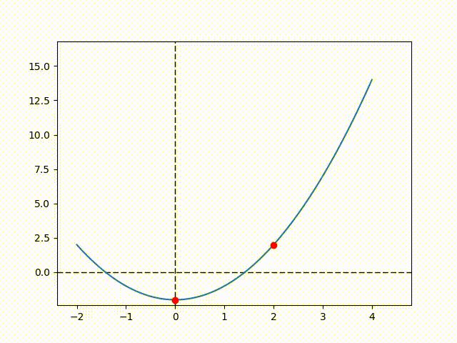

# Exercise 5
> 今回は簡単な数値計算に触れたいと思います

> 関数を用いてみるので, 慣れてみてください


## 関数の簡単な説明

複数の処理をひとまとめにしたものを**関数**といいます.

例えば, 

> `x` に数字を入れたら `2.0*x + 3.0` を返してくれる

という関数(名前は`foo`としておく)は次のように記述することで表せる.

```python
    def foo(x):
        return 2.0*x + 3.0
```

- `def`: 関数を定義することを表す
- `foo`: 今回は関数名を`foo`としたのでこのようになっている(pythonでは普通は関数は大文字を用いない, `Foo`とはしない)
- `( , , )`: 括弧の中には関数の中に呼び込みたい数字をここに書いておかなければいけない. この数字を**引数**という.
- インデント: わすれないでね.
- `return`: 普段は関数の最後に記述する. ここに載せた数式や変数が**戻り値**となって返る. (戻り値は必要がないときもあるので, 必ず`return`が必要というわけではない)

最低限この知識があれば数学で扱うような関数は定義できるようになると思います.

複数の処理を含む関数については, また後のExerciseで勉強しましょう.

それでは, 関数を定義してグラフを書いてみます. 引数を増やして

> `x`に数字を入れたら, `a*x**3 + b*x**2 + c*x + d` を返してくれる

というものを作ってみましょう.

グラフの書き方は*Exercise 3*を参照してもらえたらいいのですが, 実際のプロットの部分は

` plt.plot(x, <関数名>(x, その他の引数))`

としてあげれば大丈夫です.


## 二分法

さて, 二分法というアルゴリズムを覚えていますでしょうか...？

この方法を用いると, ある単調増加・減少関数 `f(x)` について

> `f(x) = 0`

となる`x`の数値解を必ず求めることができます.

gifアニメーションを


